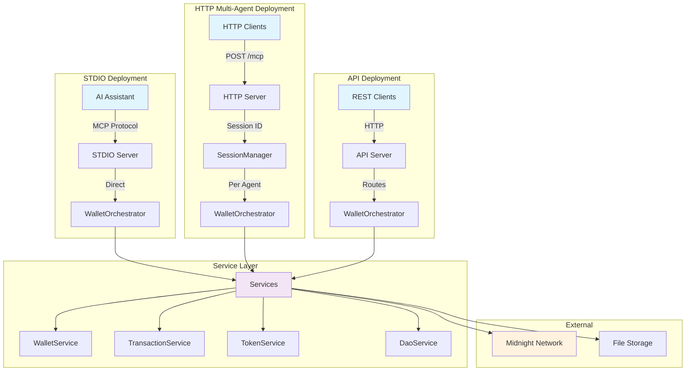

# Midnight MCP Server

A Model Context Protocol (MCP) server implementation for the Midnight blockchain network, providing AI models with secure wallet and smart contract capabilities.

## Overview

This server enables AI assistants like Claude to interact with the Midnight blockchain through a standardized protocol. It supports three deployment modes for different use cases:

- **STDIO Mode** — For AI assistants (Claude Desktop, Cursor IDE)
- **HTTP Mode** — For multi-agent platforms (100+ concurrent agents)
- **API Mode** — For traditional REST API access

## Architecture

The system uses a service-oriented architecture with direct integration:



### Server Types

#### STDIO Server (`src/mcp/stdio-server.ts`)

Direct integration for AI assistants using the Model Context Protocol.

```typescript
// How it works
AI Assistant → STDIO Transport → MCP Server → Tool Adapter → Services
```

**Use Cases:**
- Claude Desktop integration
- Cursor IDE integration
- Single-agent development

#### HTTP Server (`src/mcp/http-server.ts`)

Session-based multi-agent server with LRU cache management.

```typescript
// How it works
HTTP Client → POST /mcp → SessionManager → MCP Server (per agent) → Services
```

**Use Cases:**
- Multi-agent platforms
- 100+ concurrent agents
- Cloud deployment
- Horizontal scaling

**Key Features:**
- Session-based agent isolation via `mcp-session-id` header
- LRU cache with automatic eviction
- Prometheus metrics at `/metrics`
- Health checks at `/health`

#### API Server (`src/api/http-server.ts`)

Traditional REST API for non-MCP clients.

```typescript
// How it works
HTTP Client → Express Routes → Controllers → Services
```

**Use Cases:**
- Legacy system integration
- Custom web applications
- Testing and debugging

## Quick Start

### Prerequisites

- Node.js v18.20.5 or higher
- Yarn package manager

### Installation

```bash
# Install dependencies
yarn install

# Build the project
yarn build
```

### Agent Setup

Create a new agent with wallet credentials:

```bash
# Generate a new random seed
yarn setup-agent -a my-agent

# Or import an existing hex seed (32 bytes = 64 hex characters)
yarn setup-agent -a my-agent -s "0123456789abcdef..."

# Or import a BIP39 mnemonic phrase
yarn setup-agent -a my-agent -m "word1 word2 word3 ..."
```

The setup script will:
1. Create `.storage/seeds/my-agent/seed` with your wallet seed
2. Display your BIP39 mnemonic (for backup and GUI wallet import)
3. Show MCP configuration for AI assistants
4. Validate directory structure and permissions

**Important:** The hex seed is the actual entropy used by Midnight. The BIP39 mnemonic is a human-readable backup of the same cryptographic material.

### Running the Servers

#### STDIO Mode (AI Assistants)

For Claude Desktop or Cursor:

```bash
# Generate MCP configuration (for Claude Code with NVM)
yarn mcp:config

# Or manually configure with Node.js path
node dist/mcp/stdio-server.js
```

**MCP Configuration Example:**

```json
{
  "midnight-mcp": {
    "type": "stdio",
    "name": "Midnight MCP",
    "command": "node",
    "args": ["/absolute/path/to/dist/mcp/stdio-server.js"],
    "env": {
      "AGENT_ID": "my-agent",
      "LOG_LEVEL": "error",
      "BASE_STORAGE_DIR": "/absolute/path/to/.storage"
    },
    "cwd": "/absolute/path/to/project"
  }
}
```

See [docs/DEPLOYMENT.md](docs/DEPLOYMENT.md) for detailed configuration instructions.

#### HTTP Mode (Multi-Agent)

For platforms with multiple agents:

```bash
# Start HTTP MCP server
yarn start:mcp:http
```

**Environment Variables:**

```bash
MCP_HTTP_PORT=3001              # Server port
MAX_SESSIONS=100                # Maximum concurrent agents
SESSION_TIMEOUT=3600000         # 1 hour in milliseconds
EVICTION_INTERVAL=300000        # 5 minutes in milliseconds
BASE_STORAGE_DIR=/path/.storage # Absolute path to storage
```

**Client Usage:**

```typescript
// Send agentId in mcp-session-id header
const response = await fetch('http://localhost:3001/mcp', {
  method: 'POST',
  headers: {
    'Content-Type': 'application/json',
    'mcp-session-id': 'my-agent'
  },
  body: JSON.stringify({
    jsonrpc: '2.0',
    method: 'tools/list',
    id: 1
  })
});
```

#### API Mode (REST API)

For traditional HTTP access:

```bash
# Set agent ID
export AGENT_ID=my-agent

# Start API server
yarn start:api
```

**Endpoints:**

```bash
GET  /health              # Health check
GET  /wallet/status       # Wallet status
GET  /wallet/balance      # Get balance
POST /wallet/send         # Send transaction
GET  /dao/elections       # List DAO elections
POST /dao/vote            # Cast DAO vote
```

## MCP Tools

The server exposes 18 tools across 4 domains:

### Wallet Tools (6)

- `walletStatus` — Get wallet ready state and sync progress
- `walletAddress` — Get Bech32m wallet address
- `walletBalance` — Get native token balance
- `getTransaction` — Get transaction details by hash
- `sendNativeToken` — Send native DUST tokens
- `listTokens` — List all registered tokens

### Token Tools (4)

- `getTokenBalance` — Get shielded token balance
- `registerToken` — Register new token for tracking
- `sendShieldedToken` — Send shielded tokens
- `listTokens` — List all registered tokens

### DAO Tools (7)

- `openDaoElection` — Create new DAO election
- `castDaoVote` — Vote in DAO election
- `closeDaoElection` — Close election and tally votes
- `fundDaoTreasury` — Add funds to DAO treasury
- `getDaoConfig` — Get DAO configuration
- `getDaoElection` — Get election details
- `listDaoElections` — List all elections
- `getVotingPower` — Check voting power

### Marketplace Tools (3)

- `getUserInfo` — Get user registration info
- `isUserRegistered` — Check registration status
- `isUserVerified` — Check verification status

See [docs/wallet-mcp-api.md](docs/wallet-mcp-api.md) for complete API reference.

## File Storage Structure

The system uses agent-specific isolated storage:

```
.storage/
├── seeds/                    # Agent wallet seeds
│   └── {agentId}/
│       └── seed              # 32-byte hex entropy
├── wallet-backups/           # Wallet state backups
│   └── {agentId}/
│       └── wallet.json       # Serialized wallet state
├── transaction-db/           # Transaction databases
│   └── {agentId}/
│       ├── transactions.db   # SQLite transaction history
│       └── token-registry.db # Registered tokens
└── logs/                     # Agent-specific logs
    └── {agentId}/
        └── *.log
```

**Security Notes:**
- Seeds are stored in plaintext (use encryption in production)
- File permissions: 0o644 (files), 0o755 (directories)
- Add `.storage/` to `.gitignore`
- Consider HSM or encrypted storage for production

## Service Architecture

The system uses a `WalletOrchestrator` to coordinate services:

```typescript
// Service initialization order
WalletOrchestrator
  ├── WalletService          // Core wallet operations
  ├── TransactionService     // Transaction lifecycle
  ├── TokenService           // Token registration & transfer
  ├── AuditService           // Transaction audit trail
  ├── RecoveryService        // Wallet recovery
  ├── DaoService             // DAO voting (optional)
  └── MarketplaceService     // Marketplace (optional)
```

**Benefits:**
- Clean dependency injection
- Correct initialization order
- Unified lifecycle management
- Graceful shutdown handling

## Project Structure

```
midnight-mcp/
├── src/
│   ├── mcp/                  # MCP servers
│   │   ├── stdio-server.ts   # STDIO mode
│   │   ├── http-server.ts    # HTTP multi-agent mode
│   │   ├── mcp-server.ts     # Core MCP implementation
│   │   └── session/          # Session management
│   ├── api/                  # REST API server
│   │   ├── http-server.ts    # API mode
│   │   └── routes/           # Express routes
│   ├── lib/
│   │   ├── services/         # Service layer
│   │   │   ├── wallet.ts     # WalletService
│   │   │   ├── transaction.ts# TransactionService
│   │   │   ├── token.ts      # TokenService
│   │   │   └── orchestrator.ts # WalletOrchestrator
│   │   ├── utils/            # Utilities
│   │   │   ├── file-manager.ts  # File operations
│   │   │   └── seed-manager.ts  # Seed management
│   │   └── config/           # Configuration
│   └── contracts/            # Smart contracts
│       ├── dao/              # DAO contract integration
│       └── marketplace/      # Marketplace contract
├── test/
│   ├── unit/                 # Unit tests (mocked services)
│   ├── integration/          # Integration tests
│   └── e2e/                  # End-to-end tests
├── scripts/
│   ├── setup-agent.ts        # Agent setup script
│   └── generate-mcp-config.sh # MCP config generator
└── docs/
    ├── ARCHITECTURE.md       # Technical architecture
    ├── DEPLOYMENT.md         # Deployment guide
    ├── setup-guide.md        # Setup instructions
    ├── system-design.md      # System design
    └── wallet-mcp-api.md     # API reference
```

## Testing

```bash
# Run all tests
yarn test

# Unit tests only (with coverage)
yarn test:unit

# Integration tests
yarn test:integration

# End-to-end tests
yarn test:e2e
```

**Test Coverage:**
- Unit tests: 429 tests across 18 test suites
- Integration tests: HTTP server with real transport
- E2E tests: ElizaOS integration with real wallet operations

## Configuration

Environment variables with sensible defaults:

```bash
# Required
AGENT_ID=my-agent                    # Agent identifier

# Network (defaults to TestNet)
NETWORK_ID=TestNet                   # MainNet | TestNet | DevNet
INDEXER=https://indexer.testnet...   # Indexer URL
INDEXER_WS=wss://indexer.testnet...  # Indexer WebSocket
MN_NODE=https://rpc.testnet...       # RPC node URL
PROOF_SERVER=http://127.0.0.1:6300   # Proof server

# Storage (defaults to .storage)
BASE_STORAGE_DIR=.storage            # Storage directory
WALLET_FILENAME=wallet               # Wallet state filename

# Logging (defaults to info)
LOG_LEVEL=info                       # error | warn | info | debug

# Contracts (optional - enables services)
DAO_CONTRACT_ADDRESS=0x...           # Enable DaoService
MARKETPLACE_CONTRACT_ADDRESS=0x...   # Enable MarketplaceService

# HTTP Server (for multi-agent mode)
MCP_HTTP_PORT=3001                   # HTTP server port
MAX_SESSIONS=100                     # Max concurrent agents
SESSION_TIMEOUT=3600000              # Session timeout (ms)
EVICTION_INTERVAL=300000             # LRU cleanup interval (ms)

# API Server (for REST mode)
API_PORT=3000                        # API server port
```

See [docs/setup-guide.md](docs/setup-guide.md) for detailed configuration options.

## Documentation

- [Setup Guide](docs/setup-guide.md) — Installation and configuration
- [Architecture](docs/ARCHITECTURE.md) — Technical architecture deep-dive
- [Deployment](docs/DEPLOYMENT.md) — Deployment methods and examples
- [System Design](docs/system-design.md) — System design and flows
- [API Reference](docs/wallet-mcp-api.md) — Complete API documentation
- [Documentation Index](docs/index.md) — All documentation

## Common Issues

### BigInt Serialization Error

If you see `Do not know how to serialize a BigInt`:

- This is handled automatically in HTTP mode via global BigInt patch
- Issue occurs when Midnight SDK returns BigInt values
- Solution is already applied in `src/mcp/http-server.ts`

### Path Resolution Error

If you see `ENOENT: no such file or directory, mkdir '/.storage'`:

- Ensure `BASE_STORAGE_DIR` is set to absolute path in MCP config
- Set `cwd` to project root in MCP config
- Use `yarn mcp:config` to generate correct configuration

### Wallet Not Syncing

If wallet shows 0% sync progress:

- Check network connectivity to indexer and RPC node
- Verify `NETWORK_ID` matches your seed's network
- Check logs for connection errors
- Wait for initial sync (can take 1-2 minutes)

### Session Eviction

If HTTP sessions are evicted unexpectedly:

- Increase `MAX_SESSIONS` if you need more concurrent agents
- Increase `SESSION_TIMEOUT` if agents are idle longer
- Check `/metrics` endpoint for eviction statistics

## License

MIT License
