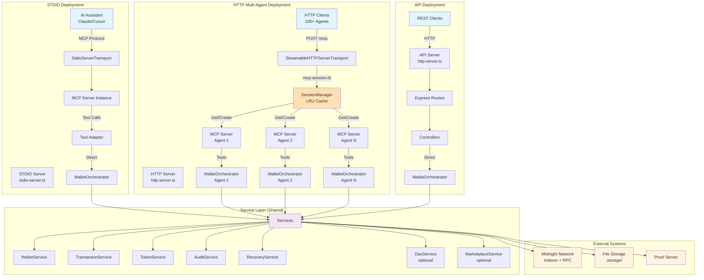
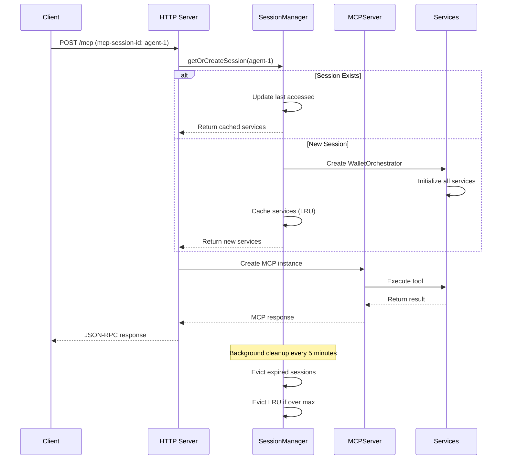
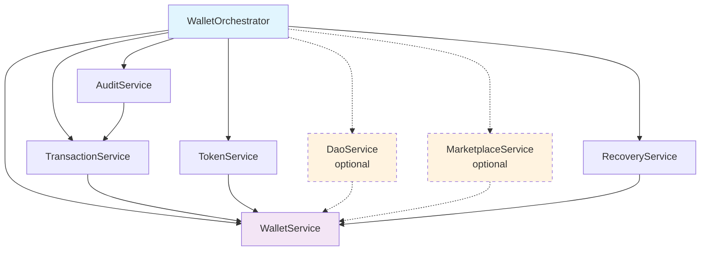
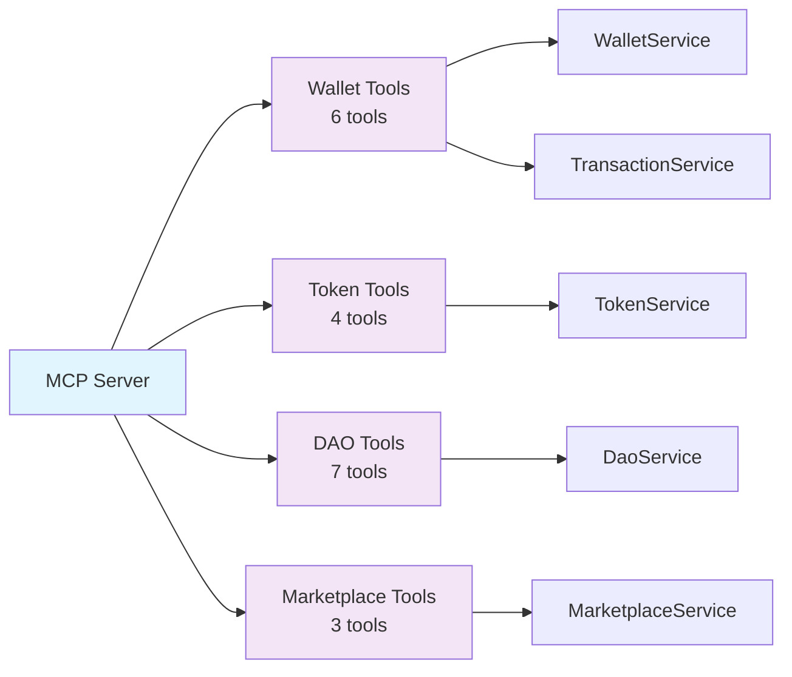
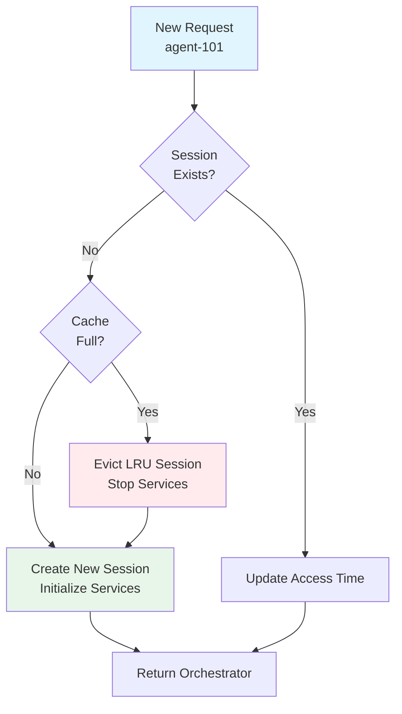
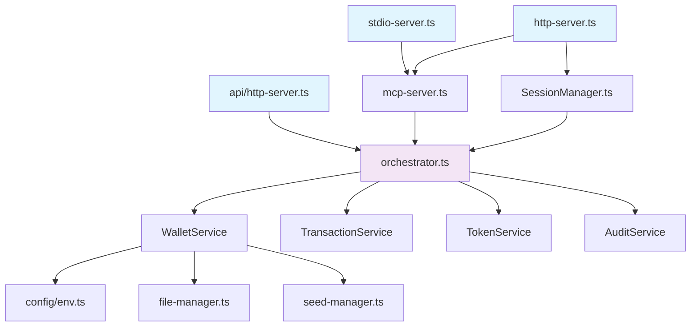

# Midnight MCP Server Architecture

Comprehensive technical architecture documentation for developers.

## Table of Contents

- [Overview](#overview)
- [Three-Server Architecture](#three-server-architecture)
- [Service Layer](#service-layer)
- [MCP Protocol Implementation](#mcp-protocol-implementation)
- [Session Management](#session-management)
- [File Storage System](#file-storage-system)
- [Configuration System](#configuration-system)
- [BigInt Serialization](#bigint-serialization)
- [Code Organization](#code-organization)

## Overview

The Midnight MCP server implements a service-oriented architecture with three distinct server types, each optimized for specific use cases. The system follows clean architecture principles with clear separation between protocol, service, and storage layers.

### Design Principles

- **Direct Integration** — Services accessed directly without unnecessary HTTP proxies
- **Dependency Injection** — Clean service initialization via WalletOrchestrator
- **Session Isolation** — Per-agent storage and service instances
- **Type Safety** — Zod validation for configuration and runtime types
- **Tool Adapter Pattern** — No switch statements, tools route themselves

##Three-Server Architecture

### Architecture Diagram



### 1. STDIO Server

**File:** `src/mcp/stdio-server.ts`

**Purpose:** Single-agent MCP server for AI assistants.

**Flow:**

```typescript
// Initialization
FileManager.resetInstance();
const config = getConfig();
const orchestrator = new WalletOrchestrator(config);
await orchestrator.start();

const mcpServer = new MCPServer(orchestrator);
const transport = new StdioServerTransport();

await mcpServer.connect(transport);
```

**Key Characteristics:**
- Single agent per process
- Direct service access (no HTTP)
- STDIO transport for MCP protocol
- Configured via environment variables
- Initialized once at startup

**Use Cases:**
- Claude Desktop integration
- Cursor IDE integration
- Local development
- Single-agent scenarios

### 2. HTTP Server

**File:** `src/mcp/http-server.ts`

**Purpose:** Multi-agent MCP server with session management.

**Flow:**

```typescript
// Server initialization
const sessionManager = new SessionManager({
  maxSessions: 100,
  sessionTimeout: 3600000,
  evictionInterval: 300000
});

// Per-request handling
const agentId = request.headers['mcp-session-id'];
const orchestrator = await sessionManager.getOrCreateSession(agentId);
const mcpServer = new MCPServer(orchestrator);

const transport = new StreamableHTTPServerTransport({
  sessionId: agentId,
  stateless: true
});

await transport.handleRequest(request, response);
```

**Key Characteristics:**
- Multiple agents per process
- LRU cache for session management
- HTTP transport with session IDs
- Automatic session eviction
- Prometheus metrics

**Session Lifecycle:**



**Use Cases:**
- Multi-agent platforms
- Cloud deployment
- 100+ concurrent agents
- Horizontal scaling

### 3. API Server

**File:** `src/api/http-server.ts`

**Purpose:** Traditional REST API for non-MCP clients.

**Flow:**

```typescript
// Server initialization
const app = express();
const orchestrator = new WalletOrchestrator(config);
await orchestrator.start();

// Routes
app.get('/wallet/status', walletController.getStatus);
app.get('/wallet/balance', walletController.getBalance);
app.post('/wallet/send', walletController.sendTransaction);
```

**Key Characteristics:**
- Single agent per process
- Express.js REST API
- Traditional HTTP endpoints
- Direct controller access to services

**Use Cases:**
- Legacy system integration
- Custom web applications
- Testing and debugging
- Non-MCP clients

## Service Layer

### WalletOrchestrator Pattern

The `WalletOrchestrator` coordinates all services with proper initialization order and dependency injection.

**File:** `src/lib/services/orchestrator.ts`

```typescript
export class WalletOrchestrator {
  private services: {
    wallet: WalletService;
    transaction: TransactionService;
    token: TokenService;
    audit: AuditService;
    recovery: RecoveryService;
    dao?: DaoService;
    marketplace?: MarketplaceService;
  };

  async start(): Promise<void> {
    // 1. Initialize core services
    await this.services.wallet.start();
    await this.services.transaction.start();
    await this.services.token.start();

    // 2. Initialize audit and recovery
    await this.services.audit.start();
    await this.services.recovery.start();

    // 3. Initialize optional contract services
    if (this.services.dao) await this.services.dao.start();
    if (this.services.marketplace) await this.services.marketplace.start();
  }

  async stop(): Promise<void> {
    // Graceful shutdown in reverse order
  }
}
```

**Benefits:**
- Correct initialization order
- Dependency injection between services
- Unified lifecycle management
- Health monitoring
- Graceful shutdown

### Service Dependency Graph



### Core Services

#### WalletService

**Responsibilities:**
- Wallet initialization and sync
- Address management
- Balance queries
- Wallet state persistence

**Key Methods:**
```typescript
interface WalletService {
  start(): Promise<void>;
  getAddress(): Promise<string>;
  getBalance(): Promise<bigint>;
  waitForSync(timeout?: number): Promise<void>;
  isReady(): boolean;
}
```

#### TransactionService

**Responsibilities:**
- Transaction creation and submission
- Confirmation tracking with polling
- Transaction history
- Fee estimation

**Key Methods:**
```typescript
interface TransactionService {
  send(params: SendParams): Promise<string>;
  getTransaction(hash: string): Promise<Transaction>;
  waitForConfirmation(hash: string): Promise<Transaction>;
  listTransactions(limit?: number): Promise<Transaction[]>;
}
```

#### TokenService

**Responsibilities:**
- Token registration
- Shielded token transfers
- Token balance queries
- Token metadata management

**Key Methods:**
```typescript
interface TokenService {
  registerToken(address: string): Promise<void>;
  sendShieldedToken(params: SendTokenParams): Promise<string>;
  getTokenBalance(address: string): Promise<bigint>;
  listTokens(): Promise<Token[]>;
}
```

#### AuditService

**Responsibilities:**
- Transaction audit trail
- Operation logging
- Trace queries
- Compliance tracking

**Key Methods:**
```typescript
interface AuditService {
  logTransaction(tx: Transaction): Promise<void>;
  getAuditTrail(filters: AuditFilters): Promise<AuditEntry[]>;
  traceTransaction(hash: string): Promise<AuditTrace>;
}
```

#### RecoveryService

**Responsibilities:**
- Wallet recovery from seed
- Exponential backoff for retries
- State restoration
- Error recovery

**Key Methods:**
```typescript
interface RecoveryService {
  recoverWallet(): Promise<void>;
  retryWithBackoff<T>(fn: () => Promise<T>): Promise<T>;
  restoreState(backup: WalletBackup): Promise<void>;
}
```

### Optional Services

#### DaoService

**Enabled When:** `DAO_CONTRACT_ADDRESS` environment variable is set.

**Responsibilities:**
- Election management
- Vote casting
- Treasury operations
- Configuration queries

#### MarketplaceService

**Enabled When:** `MARKETPLACE_CONTRACT_ADDRESS` environment variable is set.

**Responsibilities:**
- User registration
- Verification status
- Marketplace operations

## MCP Protocol Implementation

### MCPServer Class

**File:** `src/mcp/mcp-server.ts`

The `MCPServer` class implements the Model Context Protocol specification.

**Capabilities:**

```typescript
{
  capabilities: {
    tools: {},      // 18 tools across 4 domains
    resources: {},  // Read-only data sources
    prompts: {}     // Reusable message templates
  }
}
```

### Tool Adapter Pattern

Tools route themselves without switch statements:

```typescript
// Old pattern (removed)
switch (toolName) {
  case 'walletStatus':
    return handleWalletStatus();
  case 'walletBalance':
    return handleWalletBalance();
  // ... 16 more cases
}

// New pattern (current)
const tools: Record<string, Tool> = {
  walletStatus: {
    name: 'walletStatus',
    description: '...',
    inputSchema: {...},
    execute: async (args, orchestrator) => {
      const status = await orchestrator.services.wallet.getStatus();
      return { content: [{ type: 'text', text: JSON.stringify(status) }] };
    }
  }
};
```

**Benefits:**
- No switch statements
- Self-contained tool definitions
- Easy to add/remove tools
- Type-safe tool execution
- Clean separation of concerns

### Tool Categories



### Resources

Resources provide read-only access to data:

```typescript
{
  resources: [
    {
      uri: 'wallet://status',
      name: 'Wallet Status',
      mimeType: 'application/json'
    },
    {
      uri: 'wallet://transactions',
      name: 'Transaction History',
      mimeType: 'application/json'
    }
  ]
}
```

### Prompts

Reusable message templates for common tasks:

```typescript
{
  prompts: [
    {
      name: 'check-balance',
      description: 'Check wallet balance',
      arguments: []
    },
    {
      name: 'send-tokens',
      description: 'Send tokens to address',
      arguments: [
        { name: 'to', description: 'Recipient address' },
        { name: 'amount', description: 'Amount to send' }
      ]
    }
  ]
}
```

## Session Management

### SessionManager Architecture

**File:** `src/mcp/session/SessionManager.ts`

The `SessionManager` handles multi-agent coordination with LRU cache.

```typescript
export class SessionManager {
  private sessions: LRUCache<string, WalletOrchestrator>;
  private config: SessionConfig;

  constructor(config: SessionConfig) {
    this.sessions = new LRUCache({
      max: config.maxSessions,
      ttl: config.sessionTimeout,
      dispose: async (orchestrator) => {
        await orchestrator.stop();
      }
    });
  }

  async getOrCreateSession(agentId: string): Promise<WalletOrchestrator> {
    // Check cache
    let orchestrator = this.sessions.get(agentId);

    if (!orchestrator) {
      // Validate agent exists
      if (!SeedManager.hasAgentSeed(agentId)) {
        throw new Error(`Agent not found: ${agentId}`);
      }

      // Create new orchestrator
      orchestrator = new WalletOrchestrator({ agentId });
      await orchestrator.start();

      // Cache it
      this.sessions.set(agentId, orchestrator);
    }

    return orchestrator;
  }
}
```

### LRU Cache Behavior



### Session Metrics

The `SessionManager` tracks metrics via Prometheus:

```typescript
{
  activeSessions: 42,
  totalCreated: 158,
  totalEvicted: 16,
  totalClosed: 100,
  cacheHitRate: 0.92,
  avgSessionDuration: 1847 // seconds
}
```

**Endpoints:**
- `GET /metrics` — Prometheus metrics
- `GET /health` — Health check
- `POST /cleanup/:agentId` — Manual session cleanup

## File Storage System

### Storage Structure

```
.storage/
├── seeds/                           # Wallet seeds (32-byte entropy)
│   ├── agent-1/
│   │   └── seed                     # Hex-encoded seed
│   ├── agent-2/
│   │   └── seed
│   └── agent-N/
│       └── seed
├── wallet-backups/                  # Wallet state backups
│   ├── agent-1/
│   │   └── wallet.json              # Serialized wallet
│   └── agent-2/
│       └── wallet.json
├── transaction-db/                  # SQLite databases
│   ├── agent-1/
│   │   ├── transactions.db          # Transaction history
│   │   └── token-registry.db        # Registered tokens
│   └── agent-2/
│       ├── transactions.db
│       └── token-registry.db
└── logs/                            # Application logs
    ├── agent-1/
    │   ├── app-2025-01-20.log
    │   └── error-2025-01-20.log
    └── agent-2/
        ├── app-2025-01-20.log
        └── error-2025-01-20.log
```

### FileManager Class

**File:** `src/lib/utils/file-manager.ts`

Singleton pattern with reset capability for testing:

```typescript
export class FileManager {
  private static instance?: FileManager;
  private config: Required<FileConfig>;

  static getInstance(config?: FileConfig): FileManager {
    if (!FileManager.instance) {
      FileManager.instance = new FileManager(config);
    }
    return FileManager.instance;
  }

  static resetInstance(): void {
    FileManager.instance = undefined;
  }

  getPath(fileType: FileType, agentId: string, filename?: string): string {
    const typeDir = this.getTypeDirectory(fileType);
    const agentDir = path.join(typeDir, agentId);
    return filename ? path.join(agentDir, filename) : agentDir;
  }

  writeFile(fileType: FileType, agentId: string, data: string | Buffer, filename: string): void {
    const filePath = this.getPath(fileType, agentId, filename);
    const dirPath = path.dirname(filePath);

    this.ensureDirectoryExists(dirPath);
    fs.writeFileSync(filePath, data, { mode: this.config.fileMode });
  }
}
```

### SeedManager Class

**File:** `src/lib/utils/seed-manager.ts`

Manages agent seeds with validation:

```typescript
export class SeedManager {
  private static storageDir: string;

  static initialize(storageDir: string): void {
    this.storageDir = storageDir;
  }

  static async initializeAgentSeed(agentId: string, seed: string): Promise<void> {
    // Validate seed format (32 bytes = 64 hex chars)
    if (!/^[0-9a-fA-F]{64}$/.test(seed)) {
      throw new Error('Invalid seed format');
    }

    const fileManager = FileManager.getInstance();
    fileManager.writeFile(FileType.SEED, agentId, seed, 'seed');
  }

  static hasAgentSeed(agentId: string): boolean {
    const fileManager = FileManager.getInstance();
    return fileManager.fileExists(FileType.SEED, agentId, 'seed');
  }

  static getAgentSeed(agentId: string): string {
    const fileManager = FileManager.getInstance();
    return fileManager.readFile(FileType.SEED, agentId, 'seed');
  }
}
```

### Path Resolution

The system resolves paths from the project root, not `process.cwd()`:

**File:** `src/lib/config/env.ts`

```typescript
// Calculate project root from module location
const rootDir = path.resolve(__dirname, '../../..');

export function resolveProjectPath(relativePath: string): string {
  return path.isAbsolute(relativePath)
    ? relativePath
    : path.resolve(rootDir, relativePath);
}

// Priority order for BASE_STORAGE_DIR
// 1. Explicit config parameter
// 2. Environment variable BASE_STORAGE_DIR
// 3. Default: .storage (resolved from rootDir)
const baseDir = config.baseDir
  || process.env.BASE_STORAGE_DIR
  || resolveProjectPath('.storage');
```

## Configuration System

### Environment Variable Validation

**File:** `src/lib/config/env.ts`

Uses Zod for type-safe configuration:

```typescript
const envSchema = z.object({
  // Required
  AGENT_ID: z.string().min(1),

  // Network (with defaults)
  NETWORK_ID: z.enum(['MainNet', 'TestNet', 'DevNet']).default('TestNet'),
  INDEXER: z.string().url().default(TESTNET_CONFIG.indexer),
  INDEXER_WS: z.string().url().default(TESTNET_CONFIG.indexerWs),
  MN_NODE: z.string().url().default(TESTNET_CONFIG.node),
  PROOF_SERVER: z.string().url().default('http://127.0.0.1:6300'),

  // Storage
  BASE_STORAGE_DIR: z.string().default('.storage'),
  WALLET_FILENAME: z.string().default('wallet'),

  // Logging
  LOG_LEVEL: z.enum(['error', 'warn', 'info', 'debug']).default('info'),

  // Optional contracts
  DAO_CONTRACT_ADDRESS: z.string().optional(),
  MARKETPLACE_CONTRACT_ADDRESS: z.string().optional(),

  // HTTP server (multi-agent mode)
  MCP_HTTP_PORT: z.coerce.number().default(3001),
  MAX_SESSIONS: z.coerce.number().default(100),
  SESSION_TIMEOUT: z.coerce.number().default(3600000),
  EVICTION_INTERVAL: z.coerce.number().default(300000),

  // API server
  API_PORT: z.coerce.number().default(3000)
});

export function getConfig(): Config {
  const result = envSchema.safeParse(process.env);

  if (!result.success) {
    throw new Error(`Configuration validation failed: ${result.error}`);
  }

  return result.data;
}
```

### Network Configurations

```typescript
export const TESTNET_CONFIG = {
  networkId: 'TestNet',
  indexer: 'https://indexer.testnet.midnight.network',
  indexerWs: 'wss://indexer.testnet.midnight.network',
  node: 'https://rpc.testnet.midnight.network',
  proofServer: 'http://127.0.0.1:6300'
};

export const MAINNET_CONFIG = {
  networkId: 'MainNet',
  indexer: 'https://indexer.midnight.network',
  indexerWs: 'wss://indexer.midnight.network',
  node: 'https://rpc.midnight.network',
  proofServer: 'http://127.0.0.1:6300'
};
```

## BigInt Serialization

### The Problem

Midnight SDK returns `BigInt` values for blockchain data (balances, amounts, block numbers). JavaScript's `JSON.stringify()` cannot serialize `BigInt`:

```typescript
JSON.stringify({ balance: 1000n });
// Error: Do not know how to serialize a BigInt
```

### The Solution

**File:** `src/mcp/http-server.ts` (lines 1-38)

Global `BigInt` prototype patch applied before any imports:

```typescript
// Global BigInt serialization patch - MUST be first!
(BigInt.prototype as any).toJSON = function() {
  return this.toString();
};

// Also patch JSON.stringify globally
const originalStringify = JSON.stringify;
(globalThis as any).JSON.stringify = function(
  value: any,
  replacer?: ((key: string, value: any) => any) | (string | number)[] | null,
  space?: string | number
): string {
  const bigIntReplacer = (key: string, val: any): any => {
    if (typeof val === 'bigint') {
      return val.toString();
    }
    return val;
  };

  if (!replacer) {
    return originalStringify(value, bigIntReplacer, space);
  } else if (typeof replacer === 'function') {
    const combinedReplacer = (key: string, val: any): any => {
      if (typeof val === 'bigint') {
        return val.toString();
      }
      return replacer(key, val);
    };
    return originalStringify(value, combinedReplacer, space);
  } else {
    const wrappedValue = JSON.parse(originalStringify(value, bigIntReplacer));
    return originalStringify(wrappedValue, replacer as (string | number)[], space);
  }
};
```

**Why Global?**
- HTTP transport performs multiple serialization passes
- Tools, transport, and logging all use `JSON.stringify()`
- Cannot modify external SDK types
- Must be applied before any module imports

**Transport Configuration:**

```typescript
const transport = new StreamableHTTPServerTransport({
  serverUrl: `http://localhost:${port}/mcp`,
  stateless: true,
  enableJsonResponse: true, // Safe with BigInt patch
  maxRequestsPerSecond: 100
});
```

## Code Organization

### Directory Structure

```
src/
├── mcp/                              # MCP servers
│   ├── stdio-server.ts               # STDIO mode entry point
│   ├── http-server.ts                # HTTP multi-agent entry point
│   ├── mcp-server.ts                 # Core MCP implementation
│   ├── session/                      # Session management
│   │   └── SessionManager.ts         # LRU cache-based sessions
│   └── tools/                        # Tool definitions
│       ├── wallet-tools.ts           # Wallet operations
│       ├── token-tools.ts            # Token operations
│       ├── dao-tools.ts              # DAO operations
│       └── marketplace-tools.ts      # Marketplace operations
├── api/                              # REST API server
│   ├── http-server.ts                # API mode entry point
│   ├── routes/                       # Express routes
│   │   ├── wallet.ts                 # Wallet endpoints
│   │   ├── dao.ts                    # DAO endpoints
│   │   └── marketplace.ts            # Marketplace endpoints
│   └── controllers/                  # Request handlers
├── lib/
│   ├── services/                     # Service layer
│   │   ├── orchestrator.ts           # WalletOrchestrator
│   │   ├── wallet.ts                 # WalletService
│   │   ├── transaction.ts            # TransactionService
│   │   ├── token.ts                  # TokenService
│   │   ├── audit.ts                  # AuditService
│   │   ├── recovery.ts               # RecoveryService
│   │   ├── dao.ts                    # DaoService
│   │   └── marketplace.ts            # MarketplaceService
│   ├── utils/                        # Utilities
│   │   ├── file-manager.ts           # File operations
│   │   ├── seed-manager.ts           # Seed management
│   │   └── logger.ts                 # Logging
│   └── config/                       # Configuration
│       └── env.ts                    # Environment validation
├── contracts/                        # Smart contracts
│   ├── dao/                          # DAO contract
│   │   ├── contract/                 # Compiled contract
│   │   └── integration.ts            # Contract integration
│   └── marketplace/                  # Marketplace contract
│       ├── contract/                 # Compiled contract
│       └── integration.ts            # Contract integration
└── audit/                            # Audit system
    ├── audit-manager.ts              # Audit coordination
    └── storage/                      # Audit storage
```

### Module Dependencies



### Import Patterns

```typescript
// Good: Absolute imports via tsconfig paths
import { WalletService } from '@/lib/services/wallet';
import { getConfig } from '@/lib/config/env';
import { FileManager } from '@/lib/utils/file-manager';

// Bad: Relative imports
import { WalletService } from '../../lib/services/wallet';
import { getConfig } from '../../lib/config/env';
```

### TypeScript Configuration

**File:** `tsconfig.json`

```json
{
  "compilerOptions": {
    "target": "ES2020",
    "module": "ESNext",
    "moduleResolution": "node",
    "esModuleInterop": true,
    "strict": true,
    "skipLibCheck": true,
    "paths": {
      "@/*": ["./src/*"]
    }
  }
}
```

## Testing Architecture

See [test/README.md](../test/README.md) for comprehensive testing documentation.

### Test Layers

- **Unit Tests** — Mocked services, isolated components
- **Integration Tests** — Real HTTP transport, session management
- **E2E Tests** — Complete workflows with ElizaOS

### Mock Strategy

```typescript
// Mock Midnight wallet
export function createMockWallet(): MockWallet {
  return {
    address: jest.fn().mockResolvedValue('addr_test1q...'),
    balance: jest.fn().mockResolvedValue(1000000n),
    submitTransaction: jest.fn().mockResolvedValue('tx_hash'),
    sync: jest.fn().mockResolvedValue(undefined)
  };
}

// Mock WalletOrchestrator
export function createMockOrchestrator(): MockOrchestrator {
  return {
    services: {
      wallet: createMockWalletService(),
      transaction: createMockTransactionService(),
      token: createMockTokenService()
    },
    start: jest.fn(),
    stop: jest.fn()
  };
}
```

## Performance Considerations

### Session Management

- LRU cache with configurable size (default: 100 sessions)
- Automatic eviction of idle sessions
- Background cleanup every 5 minutes
- Per-agent service isolation

### BigInt Handling

- Global patch applied once at startup
- Zero runtime overhead
- Compatible with all serialization paths

### File I/O

- Agent-specific directory isolation
- Atomic writes with proper permissions
- Directory caching in FileManager
- Minimal filesystem operations

### Wallet Sync

- Background sync with timeout
- Exponential backoff for retries
- Sync state caching
- Graceful degradation

## Security Considerations

### Seed Storage

- Seeds stored in plaintext (32-byte hex)
- File permissions: 0o644 (owner + group read)
- Directory permissions: 0o755
- **Production:** Use encrypted storage or HSM

### Session Isolation

- Per-agent storage directories
- Separate service instances
- No shared wallet state
- Session ID validation

### API Security

- No authentication (implement before production)
- No rate limiting (implement before production)
- CORS disabled by default
- Helmet.js security headers

### Input Validation

- Zod schema validation
- Address format validation
- Amount range checks
- Contract address validation

## Deployment Considerations

### Environment Variables

Always set absolute paths for storage:

```bash
BASE_STORAGE_DIR=/absolute/path/to/.storage
```

### Process Management

Use process managers for production:

```bash
# PM2
pm2 start dist/mcp/http-server.js --name midnight-mcp

# Systemd service
[Unit]
Description=Midnight MCP Server
After=network.target

[Service]
Type=simple
ExecStart=/usr/bin/node /path/to/dist/mcp/http-server.js
EnvironmentFile=/path/to/.env
Restart=on-failure

[Install]
WantedBy=multi-user.target
```

### Monitoring

- Prometheus metrics at `/metrics`
- Health checks at `/health`
- Log aggregation (use LOG_LEVEL=error in production)
- Session statistics tracking

### Scaling

- Horizontal scaling supported (stateless HTTP transport)
- Use load balancer with sticky sessions
- Shared storage for agent isolation
- Redis for distributed session management (future)

## References

- [Model Context Protocol Specification](https://modelcontextprotocol.io/)
- [Midnight SDK Documentation](https://midnight.network/docs)
- [MCP TypeScript SDK](https://github.com/modelcontextprotocol/typescript-sdk)
- [Zod Validation](https://zod.dev/)
- [LRU Cache](https://github.com/isaacs/node-lru-cache)
