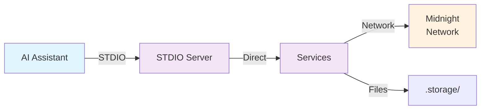
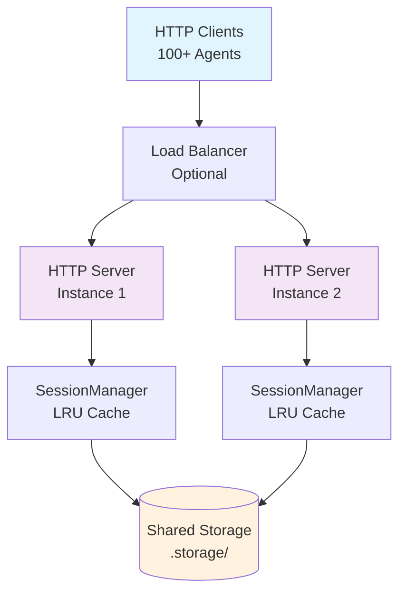
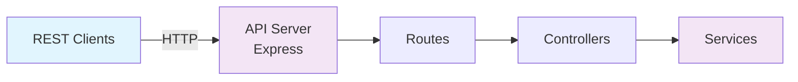

# Deployment Guide

Complete deployment guide for all three server modes with configuration examples and best practices.

## Table of Contents

- [Overview](#overview)
- [Prerequisites](#prerequisites)
- [Agent Setup](#agent-setup)
- [STDIO Deployment](#stdio-deployment)
- [HTTP Multi-Agent Deployment](#http-multi-agent-deployment)
- [API Deployment](#api-deployment)
- [Production Considerations](#production-considerations)
- [Troubleshooting](#troubleshooting)

## Overview

The Midnight MCP server supports three deployment modes:

| Mode | Use Case | Agent Count | Transport |
|------|----------|-------------|-----------|
| **STDIO** | AI assistants (Claude, Cursor) | Single | Standard I/O |
| **HTTP** | Multi-agent platforms | 100+ | HTTP with sessions |
| **API** | Legacy systems, custom apps | Single | REST API |

## Prerequisites

### System Requirements

- **Node.js:** v18.20.5 or higher (v20+ recommended)
- **Yarn:** Package manager
- **Memory:** 512MB minimum per agent
- **Storage:** 100MB per agent (seeds + wallet state)

### Installation

```bash
# Clone repository
git clone https://github.com/your-org/midnight-mcp.git
cd midnight-mcp

# Install dependencies
yarn install

# Build project
yarn build
```

### Verify Installation

```bash
# Check Node.js version
node --version  # Should be v18.20.5+

# Verify build
ls -la dist/
# Should contain: mcp/, api/, lib/, contracts/

# Test configuration
node -e "const { getConfig } = require('./dist/lib/config/env'); console.log('Config OK')"
```

## Agent Setup

Before deploying any server mode, create agent(s) with wallet credentials.

### Generate New Agent

Create a new agent with random seed:

```bash
yarn setup-agent -a my-agent
```

**Output:**

```
✓ Project root validated
✓ .storage directory validated
✓ Directory validated: .storage/seeds
✓ Directory validated: .storage/wallet-backups
✓ Directory validated: .storage/logs
✓ Directory validated: .storage/transaction-db

Generating new random seed

Agent setup completed successfully!

=== Generated Wallet Information ===
Midnight Seed (hex):
0123456789abcdef0123456789abcdef0123456789abcdef0123456789abcdef

BIP39 Mnemonic:
word1 word2 word3 word4 word5 word6 word7 word8 word9 word10 word11 word12
word13 word14 word15 word16 word17 word18 word19 word20 word21 word22 word23 word24

Important Note for Midnight Wallet:
For Midnight, your wallet seed is the entropy value shown above
The BIP39 mnemonic can be imported into any GUI wallet that supports the Midnight blockchain

=== MCP Server Configuration ===
For Cursor/Claude Desktop (STDIO), add this to your MCP settings:
{
  "midnight-mcp": {
    "type": "stdio",
    "name": "Midnight MCP",
    "command": "node",
    "args": ["/path/to/dist/mcp/stdio-server.js"],
    "env": {
      "AGENT_ID": "my-agent",
      "LOG_LEVEL": "error",
      "BASE_STORAGE_DIR": "/path/to/.storage"
    },
    "cwd": "/path/to/project"
  }
}

For Claude Code (with NVM), run this command to generate config:
  yarn mcp:config
Then paste the output into Claude Code MCP settings.
```

### Import Existing Seed

Import from hex seed:

```bash
yarn setup-agent -a my-agent -s "0123456789abcdef..."
```

Import from BIP39 mnemonic:

```bash
yarn setup-agent -a my-agent -m "word1 word2 word3 ..."
```

### Multiple Agents

For multi-agent deployment, create multiple agents:

```bash
yarn setup-agent -a agent-1
yarn setup-agent -a agent-2
yarn setup-agent -a agent-3
# ... up to N agents
```

**Storage Structure:**

```
.storage/
├── seeds/
│   ├── agent-1/seed
│   ├── agent-2/seed
│   └── agent-3/seed
├── wallet-backups/
│   ├── agent-1/wallet.json
│   ├── agent-2/wallet.json
│   └── agent-3/wallet.json
└── transaction-db/
    ├── agent-1/transactions.db
    ├── agent-2/transactions.db
    └── agent-3/transactions.db
```

## STDIO Deployment

Deploy for AI assistants (Claude Desktop, Cursor IDE, Claude Code).

### Architecture



### Configuration

#### For Claude Desktop / Cursor

Manual configuration with absolute paths:

```json
{
  "midnight-mcp": {
    "type": "stdio",
    "name": "Midnight MCP",
    "command": "node",
    "args": [
      "/absolute/path/to/midnight-mcp/dist/mcp/stdio-server.js"
    ],
    "env": {
      "AGENT_ID": "my-agent",
      "LOG_LEVEL": "error",
      "BASE_STORAGE_DIR": "/absolute/path/to/midnight-mcp/.storage",
      "NETWORK_ID": "TestNet"
    },
    "cwd": "/absolute/path/to/midnight-mcp"
  }
}
```

**Configuration Location:**

- **Claude Desktop:** `~/Library/Application Support/Claude/claude_desktop_config.json` (macOS)
- **Cursor:** Settings → MCP Servers → Add Server

#### For Claude Code (with NVM)

Auto-generate configuration with NVM Node.js path:

```bash
# Generate and copy configuration to clipboard
yarn mcp:config
```

**Output:**

```
✅ Found Node.js: v23.11.0
📍 Path: /Users/apple/.nvm/versions/node/v23.11.0/bin/node

━━━━━━━━━━━━━━━━━━━━━━━━━━━━━━━━━━━━━━━━━━━━━━━━━━━━━━━━━━━━━━━━━━━━━━━━
✨ Configuration copied to clipboard!
📋 Just paste (Cmd+V) into Claude Code MCP settings
━━━━━━━━━━━━━━━━━━━━━━━━━━━━━━━━━━━━━━━━━━━━━━━━━━━━━━━━━━━━━━━━━━━━━━━━

"midnight-mcp": {
  "type": "stdio",
  "name": "Midnight MCP",
  "command": "/Users/apple/.nvm/versions/node/v23.11.0/bin/node",
  "args": [
    "/path/to/midnight-mcp/dist/mcp/stdio-server.js"
  ],
  "env": {
    "AGENT_ID": "workshop",
    "LOG_LEVEL": "error",
    "BASE_STORAGE_DIR": "/path/to/midnight-mcp/.storage"
  },
  "cwd": "/path/to/midnight-mcp"
}
```

### Environment Variables

```bash
# Required
AGENT_ID=my-agent                    # Agent identifier

# Network (defaults to TestNet)
NETWORK_ID=TestNet                   # MainNet | TestNet | DevNet
INDEXER=https://indexer.testnet...   # Indexer URL
INDEXER_WS=wss://indexer.testnet...  # Indexer WebSocket
MN_NODE=https://rpc.testnet...       # RPC node URL
PROOF_SERVER=http://127.0.0.1:6300   # Proof server

# Storage (defaults to .storage)
BASE_STORAGE_DIR=/path/.storage      # Absolute path recommended
WALLET_FILENAME=wallet               # Wallet state filename

# Logging (defaults to info)
LOG_LEVEL=error                      # error | warn | info | debug

# Optional contracts
DAO_CONTRACT_ADDRESS=0x...           # Enable DaoService
MARKETPLACE_CONTRACT_ADDRESS=0x...   # Enable MarketplaceService
```

### Running Manually

For testing or development:

```bash
# Set environment variables
export AGENT_ID=my-agent
export BASE_STORAGE_DIR=/absolute/path/to/.storage
export LOG_LEVEL=info

# Run server
node dist/mcp/stdio-server.js
```

### Verification

Test the server from AI assistant:

```
User: Check my wallet status

Tool Call: walletStatus
Result: {
  "isReady": true,
  "address": "addr_test1q...",
  "balance": "1000000",
  "syncProgress": {
    "syncPercentage": 100,
    "currentBlock": 12345,
    "totalBlocks": 12345
  }
}
```

### Logs

Check logs for troubleshooting:

```bash
# View logs
tail -f .storage/logs/my-agent/app-$(date +%Y-%m-%d).log

# View errors only
tail -f .storage/logs/my-agent/error-$(date +%Y-%m-%d).log
```

## HTTP Multi-Agent Deployment

Deploy for platforms with 100+ concurrent agents.

### Architecture



### Configuration

Create `.env` file for HTTP server:

```bash
# HTTP Server
MCP_HTTP_PORT=3001                   # Server port
MAX_SESSIONS=100                     # Maximum concurrent agents
SESSION_TIMEOUT=3600000              # 1 hour in milliseconds
EVICTION_INTERVAL=300000             # 5 minutes in milliseconds

# Storage
BASE_STORAGE_DIR=/absolute/path/.storage

# Network (defaults to TestNet)
NETWORK_ID=TestNet
INDEXER=https://indexer.testnet.midnight.network
INDEXER_WS=wss://indexer.testnet.midnight.network
MN_NODE=https://rpc.testnet.midnight.network
PROOF_SERVER=http://127.0.0.1:6300

# Logging
LOG_LEVEL=error                      # Use error in production

# Optional contracts
DAO_CONTRACT_ADDRESS=0x...
MARKETPLACE_CONTRACT_ADDRESS=0x...
```

### Starting the Server

```bash
# Development
yarn start:mcp:http

# Production (with PM2)
pm2 start dist/mcp/http-server.js --name midnight-mcp-http \
  --env-file .env \
  --instances 2 \
  --exec-mode cluster

# Production (with systemd)
sudo systemctl start midnight-mcp-http
```

### Client Integration

#### JavaScript/TypeScript

```typescript
import { Client } from '@modelcontextprotocol/sdk/client/index.js';
import { StreamableHTTPClientTransport } from '@modelcontextprotocol/sdk/client/streamable-http.js';

async function createMCPClient(agentId: string) {
  const transport = new StreamableHTTPClientTransport({
    serverUrl: 'http://localhost:3001/mcp',
    headers: {
      'mcp-session-id': agentId
    }
  });

  const client = new Client({
    name: 'my-platform',
    version: '1.0.0'
  }, {
    capabilities: {}
  });

  await client.connect(transport);
  return client;
}

// Usage
const client = await createMCPClient('agent-123');

// Call tools
const result = await client.request({
  method: 'tools/call',
  params: {
    name: 'walletStatus',
    arguments: {}
  }
});

console.log(result);
```

#### Python

```python
import requests

def call_mcp_tool(agent_id: str, tool_name: str, args: dict) -> dict:
    response = requests.post(
        'http://localhost:3001/mcp',
        headers={
            'Content-Type': 'application/json',
            'mcp-session-id': agent_id
        },
        json={
            'jsonrpc': '2.0',
            'id': 1,
            'method': 'tools/call',
            'params': {
                'name': tool_name,
                'arguments': args
            }
        }
    )
    return response.json()

# Usage
result = call_mcp_tool('agent-123', 'walletStatus', {})
print(result)
```

#### cURL

```bash
# Call walletStatus tool
curl -X POST http://localhost:3001/mcp \
  -H "Content-Type: application/json" \
  -H "mcp-session-id: agent-123" \
  -d '{
    "jsonrpc": "2.0",
    "id": 1,
    "method": "tools/call",
    "params": {
      "name": "walletStatus",
      "arguments": {}
    }
  }'
```

### Monitoring

#### Health Check

```bash
curl http://localhost:3001/health
```

**Response:**

```json
{
  "status": "ok",
  "uptime": 3600,
  "sessions": {
    "active": 42,
    "total": 158
  }
}
```

#### Metrics (Prometheus)

```bash
curl http://localhost:3001/metrics
```

**Metrics Exposed:**

```
# Active sessions
mcp_active_sessions 42

# Total sessions created
mcp_sessions_created_total 158

# Sessions evicted (LRU)
mcp_sessions_evicted_total 16

# Sessions closed
mcp_sessions_closed_total 100

# Request duration histogram
mcp_request_duration_seconds_bucket{le="0.1"} 1234
mcp_request_duration_seconds_bucket{le="0.5"} 5678
mcp_request_duration_seconds_bucket{le="1.0"} 9012

# Tool execution count
mcp_tool_calls_total{tool="walletStatus"} 456
mcp_tool_calls_total{tool="walletBalance"} 234
```

#### Session Cleanup

```bash
# Manually cleanup specific agent session
curl -X POST http://localhost:3001/cleanup/agent-123
```

### Load Balancing

For horizontal scaling, use sticky sessions:

**Nginx Configuration:**

```nginx
upstream midnight_mcp {
    ip_hash;  # Sticky sessions based on IP
    server 127.0.0.1:3001;
    server 127.0.0.1:3002;
    server 127.0.0.1:3003;
}

server {
    listen 80;
    server_name mcp.example.com;

    location /mcp {
        proxy_pass http://midnight_mcp;
        proxy_set_header Host $host;
        proxy_set_header X-Real-IP $remote_addr;
        proxy_set_header mcp-session-id $http_mcp_session_id;
    }

    location /health {
        proxy_pass http://midnight_mcp;
    }

    location /metrics {
        proxy_pass http://midnight_mcp;
        allow 10.0.0.0/8;  # Restrict to internal network
        deny all;
    }
}
```

## API Deployment

Deploy for legacy systems and custom applications.

### Architecture



### Configuration

Create `.env` file for API server:

```bash
# Required
AGENT_ID=my-agent                    # Single agent for this server

# API Server
API_PORT=3000                        # Server port

# Storage
BASE_STORAGE_DIR=/absolute/path/.storage

# Network (defaults to TestNet)
NETWORK_ID=TestNet
INDEXER=https://indexer.testnet.midnight.network
INDEXER_WS=wss://indexer.testnet.midnight.network
MN_NODE=https://rpc.testnet.midnight.network
PROOF_SERVER=http://127.0.0.1:6300

# Logging
LOG_LEVEL=info

# Optional contracts
DAO_CONTRACT_ADDRESS=0x...
MARKETPLACE_CONTRACT_ADDRESS=0x...
```

### Starting the Server

```bash
# Development
yarn start:api

# Production (with PM2)
pm2 start dist/api/http-server.js --name midnight-api \
  --env-file .env

# Production (with systemd)
sudo systemctl start midnight-api
```

### API Endpoints

#### Wallet Endpoints

```bash
# Get wallet status
GET /wallet/status

# Get wallet address
GET /wallet/address

# Get wallet balance
GET /wallet/balance

# Get transaction by hash
GET /wallet/transaction/:hash

# Send native tokens
POST /wallet/send
Content-Type: application/json
{
  "to": "addr_test1q...",
  "amount": "1000000"
}
```

#### Token Endpoints

```bash
# List registered tokens
GET /tokens

# Get token balance
GET /tokens/:address/balance

# Register new token
POST /tokens/register
Content-Type: application/json
{
  "address": "0x..."
}

# Send shielded tokens
POST /tokens/send
Content-Type: application/json
{
  "tokenAddress": "0x...",
  "to": "addr_test1q...",
  "amount": "1000"
}
```

#### DAO Endpoints

```bash
# List elections
GET /dao/elections

# Get election details
GET /dao/elections/:id

# Open new election
POST /dao/elections
Content-Type: application/json
{
  "title": "Proposal Title",
  "description": "Proposal description",
  "duration": 86400
}

# Cast vote
POST /dao/elections/:id/vote
Content-Type: application/json
{
  "vote": "YES"
}

# Close election
POST /dao/elections/:id/close
```

#### Marketplace Endpoints

```bash
# Get user info
GET /marketplace/user

# Check registration status
GET /marketplace/user/registered

# Check verification status
GET /marketplace/user/verified
```

### Client Integration

#### JavaScript/TypeScript

```typescript
class MidnightAPIClient {
  constructor(private baseUrl: string) {}

  async getWalletStatus() {
    const response = await fetch(`${this.baseUrl}/wallet/status`);
    return response.json();
  }

  async sendTokens(to: string, amount: string) {
    const response = await fetch(`${this.baseUrl}/wallet/send`, {
      method: 'POST',
      headers: { 'Content-Type': 'application/json' },
      body: JSON.stringify({ to, amount })
    });
    return response.json();
  }

  async listTokens() {
    const response = await fetch(`${this.baseUrl}/tokens`);
    return response.json();
  }
}

// Usage
const client = new MidnightAPIClient('http://localhost:3000');
const status = await client.getWalletStatus();
```

#### Python

```python
import requests

class MidnightAPIClient:
    def __init__(self, base_url: str):
        self.base_url = base_url

    def get_wallet_status(self):
        response = requests.get(f'{self.base_url}/wallet/status')
        return response.json()

    def send_tokens(self, to: str, amount: str):
        response = requests.post(
            f'{self.base_url}/wallet/send',
            json={'to': to, 'amount': amount}
        )
        return response.json()

    def list_tokens(self):
        response = requests.get(f'{self.base_url}/tokens')
        return response.json()

# Usage
client = MidnightAPIClient('http://localhost:3000')
status = client.get_wallet_status()
```

#### cURL

```bash
# Get wallet status
curl http://localhost:3000/wallet/status

# Send tokens
curl -X POST http://localhost:3000/wallet/send \
  -H "Content-Type: application/json" \
  -d '{"to":"addr_test1q...","amount":"1000000"}'

# List tokens
curl http://localhost:3000/tokens
```

## Production Considerations

### Security

#### Seed Storage

Seeds are stored in plaintext by default. For production:

```bash
# Option 1: Encrypted filesystem
# Use dm-crypt, LUKS, or similar
cryptsetup luksFormat /dev/sdb1
cryptsetup open /dev/sdb1 secure_storage
mkfs.ext4 /dev/mapper/secure_storage
mount /dev/mapper/secure_storage /mnt/secure_storage
export BASE_STORAGE_DIR=/mnt/secure_storage

# Option 2: HSM (Hardware Security Module)
# Modify SeedManager to use HSM for seed retrieval

# Option 3: Secrets manager
# Use AWS Secrets Manager, HashiCorp Vault, etc.
```

#### API Authentication

Add authentication middleware:

```typescript
import express from 'express';
import { authenticateJWT } from './middleware/auth';

const app = express();

// Add authentication
app.use('/wallet/*', authenticateJWT);
app.use('/tokens/*', authenticateJWT);
app.use('/dao/*', authenticateJWT);

// Public endpoints
app.get('/health', healthCheck);
```

#### Rate Limiting

```typescript
import rateLimit from 'express-rate-limit';

const limiter = rateLimit({
  windowMs: 15 * 60 * 1000, // 15 minutes
  max: 100, // 100 requests per window
  message: 'Too many requests'
});

app.use('/wallet/*', limiter);
```

### Monitoring

#### Prometheus + Grafana

```yaml
# prometheus.yml
scrape_configs:
  - job_name: 'midnight-mcp'
    static_configs:
      - targets: ['localhost:3001']
    metrics_path: '/metrics'
    scrape_interval: 15s
```

**Key Metrics to Monitor:**
- Active sessions
- Request duration
- Tool execution count
- Error rate
- Memory usage
- Session eviction rate

#### Logging

Use structured logging in production:

```bash
# Set LOG_LEVEL=error in production
LOG_LEVEL=error

# Use log aggregation (e.g., ELK Stack, Datadog)
# Configure pino transport for your logging system
```

### Backup

```bash
#!/bin/bash
# backup-storage.sh

BACKUP_DIR="/backups/midnight-mcp"
STORAGE_DIR="/path/to/.storage"
DATE=$(date +%Y%m%d-%H%M%S)

# Backup storage directory
tar -czf "$BACKUP_DIR/storage-$DATE.tar.gz" "$STORAGE_DIR"

# Backup environment config
cp .env "$BACKUP_DIR/env-$DATE.bak"

# Keep only last 7 days of backups
find "$BACKUP_DIR" -name "storage-*.tar.gz" -mtime +7 -delete
```

### Disaster Recovery

```bash
#!/bin/bash
# restore-storage.sh

BACKUP_FILE=$1
STORAGE_DIR="/path/to/.storage"

# Stop servers
pm2 stop all

# Restore storage
tar -xzf "$BACKUP_FILE" -C "$(dirname $STORAGE_DIR)"

# Restart servers
pm2 restart all
```

## Troubleshooting

### Common Issues

#### BigInt Serialization Error

**Error:** `Do not know how to serialize a BigInt`

**Solution:** Already handled in HTTP server. If error persists:

```bash
# Verify BigInt patch is applied
grep -A 5 "BigInt.prototype" dist/mcp/http-server.js

# Rebuild if necessary
yarn clean && yarn build
```

#### Path Resolution Error

**Error:** `ENOENT: no such file or directory, mkdir '/.storage'`

**Solution:**

```bash
# Use absolute paths in MCP config
"env": {
  "BASE_STORAGE_DIR": "/absolute/path/to/.storage"
},
"cwd": "/absolute/path/to/project"

# Or regenerate config
yarn mcp:config
```

#### Wallet Sync Timeout

**Error:** `Wallet sync timeout after 60000ms`

**Solution:**

```bash
# Check network connectivity
curl https://indexer.testnet.midnight.network/health

# Check RPC node
curl https://rpc.testnet.midnight.network/health

# Increase timeout in code if needed
# Or wait for initial sync (1-2 minutes)
```

#### Session Eviction

**Issue:** Sessions evicted too quickly

**Solution:**

```bash
# Increase max sessions
MAX_SESSIONS=200

# Increase session timeout (2 hours)
SESSION_TIMEOUT=7200000

# Check metrics
curl http://localhost:3001/metrics | grep evicted
```

#### High Memory Usage

**Issue:** Memory usage grows over time

**Solution:**

```bash
# Reduce max sessions
MAX_SESSIONS=50

# Reduce session timeout
SESSION_TIMEOUT=1800000  # 30 minutes

# Enable more aggressive cleanup
EVICTION_INTERVAL=60000  # 1 minute

# Monitor memory
pm2 monit
```

### Debug Mode

Enable debug logging:

```bash
# Set LOG_LEVEL=debug
LOG_LEVEL=debug

# Restart server
pm2 restart midnight-mcp

# View logs
pm2 logs midnight-mcp --lines 100
```

### Health Checks

```bash
# STDIO (check logs)
tail -f .storage/logs/my-agent/app-$(date +%Y-%m-%d).log

# HTTP (check endpoint)
curl http://localhost:3001/health

# API (check endpoint)
curl http://localhost:3000/health
```

## Additional Resources

- [Architecture Documentation](ARCHITECTURE.md)
- [Setup Guide](setup-guide.md)
- [API Reference](wallet-mcp-api.md)
- [System Design](system-design.md)
- [MCP Specification](https://modelcontextprotocol.io/)
