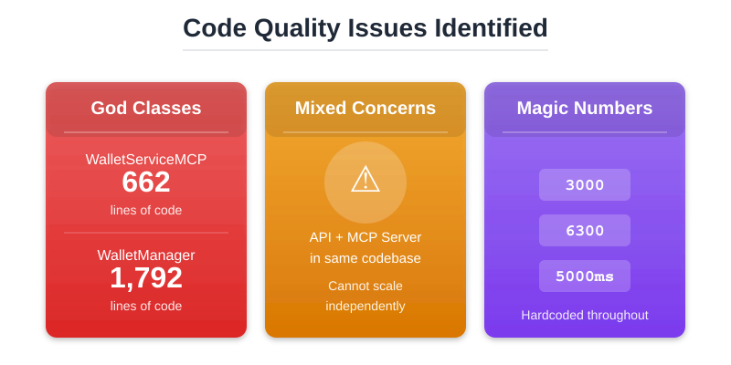
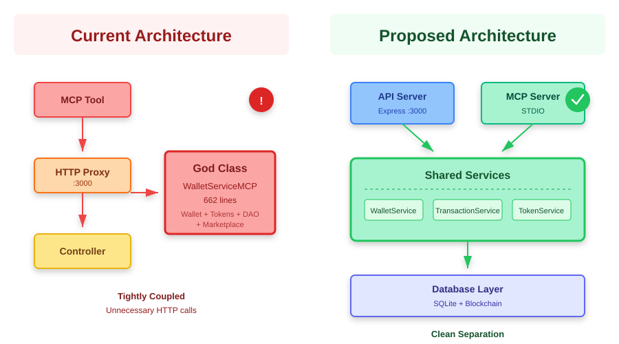
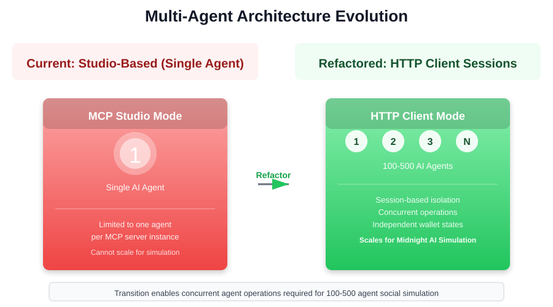
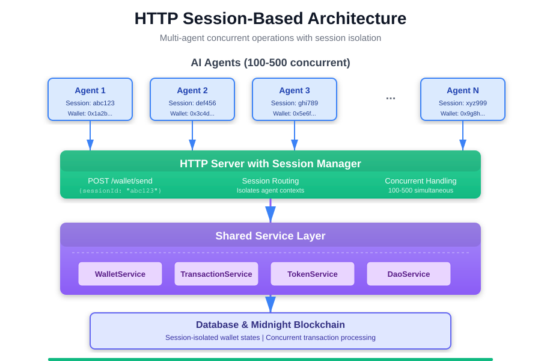
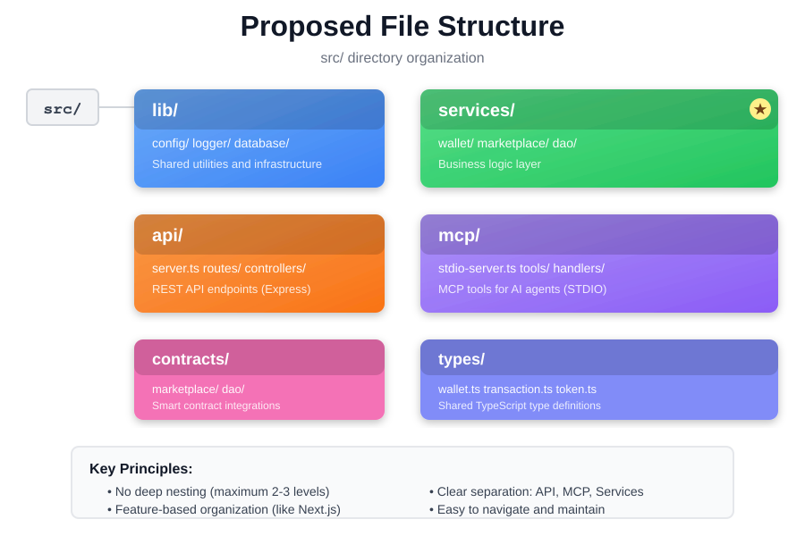
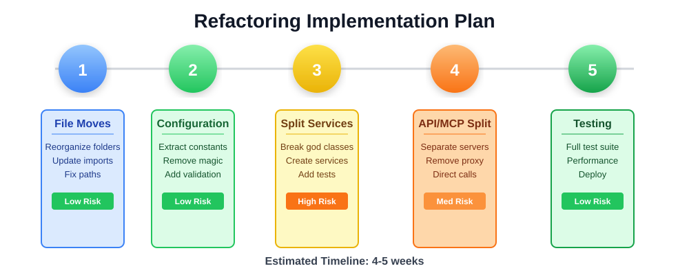
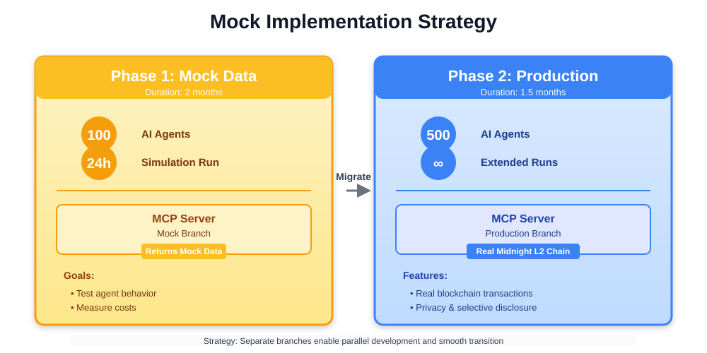

# Weekly Summary - MCP Codebase Refactoring

## Overview

This week focused on comprehensive analysis and planning for refactoring the MCP codebase. The primary objectives were to identify code quality issues, design a clean architecture, and establish a clear implementation roadmap.

---

## Work Completed

### 1. Codebase Analysis

Conducted detailed analysis of both the current MCP codebase and the reference implementation to identify architectural patterns and code quality issues.

**Key Findings:**



- **God Classes**: Identified oversized files with excessive responsibilities
  - `WalletServiceMCP`: 662 lines handling wallet, tokens, DAO, and marketplace
  - `WalletManager`: 1,792 lines with mixed concerns across infrastructure and business logic

- **Architectural Issues**: API and MCP server tightly coupled, preventing independent scaling and introducing unnecessary HTTP proxy layer for internal communication

- **Code Quality**: Widespread use of magic numbers (ports, timeouts, retry counts) hardcoded throughout the codebase without centralized configuration

### 2. Architecture Design

Designed a clean, maintainable architecture following Next.js patterns and modern TypeScript practices. The refactored architecture will support both studio mode (single agent) and multi-agent sessions through HTTP client integration.

**Architecture Comparison:**



**Key Improvements:**
- Separation of API and MCP servers enabling independent deployment and scaling
- Service layer abstraction with focused, single-responsibility classes
- Elimination of unnecessary HTTP proxy for internal service communication
- Direct service calls reducing latency and complexity
- **Multi-agent architecture support**: HTTP client-based session management for concurrent agent operations

**Multi-Agent Architecture:**
The refactored system will transition from studio-based single agent to supporting multiple concurrent agents through HTTP client integration. This enables:
- Session-based agent isolation
- Concurrent operations for 100-500 AI agents
- Scalable deployment for the Midnight AI simulation project



For session management patterns, reference implementations can be found using Context7 documentation for best practices in multi-agent coordination.

**HTTP Session Architecture:**



### 3. File Structure Design

Developed a comprehensive folder structure that prioritizes maintainability and developer experience.



**Structure Highlights:**
- `lib/`: Shared infrastructure (config, logging, database)
- `services/`: Business logic layer with domain-specific services
- `api/`: REST API endpoints using Express
- `mcp/`: MCP server tools for AI agent integration
- `contracts/`: Smart contract integrations
- `types/`: Shared TypeScript type definitions

**Design Principles:**
- Maximum 2-3 levels of nesting for easy navigation
- Feature-based organization over technical layer grouping
- Clear separation of concerns across API, MCP, and business logic

### 4. Implementation Planning

Created a phased implementation plan with risk assessment and timeline estimates.



**Five-Phase Approach:**

**Phase 1 - File Reorganization**
- Move files to new structure
- Update import paths
- Validate tests pass
- **Setup mock data branch**: Create separate branch for mock implementations required by Midnight AI Phase 1
- **MCP mock responses**: Implement mock data returns for MCP server operations to support initial 100-agent simulation testing
- Risk: Low

**Phase 2 - Configuration Cleanup**
- Extract magic numbers to constants file
- Implement Zod validation for configuration
- Centralize environment variable management
- Risk: Low

**Phase 3 - Service Extraction**
- Split `WalletServiceMCP` into focused services
- Extract `WalletService`, `TransactionService`, `TokenService`
- Add comprehensive unit tests
- Risk: High (requires careful testing)

**Phase 4 - API/MCP Separation**
- Create independent server entry points
- Remove HTTP proxy layer
- Implement direct service injection
- **HTTP client session support**: Enable multiple concurrent agent sessions
- Risk: Medium

**Phase 5 - Testing & Deployment**
- Full test suite execution
- Performance validation
- Production deployment preparation
- **Multi-agent load testing**: Validate system can handle 100-500 concurrent agents
- Risk: Low

### 5. Documentation

Created comprehensive documentation to support the refactoring effort:

- **STRUCTURE.md**: Complete folder layout with detailed explanations
- **GUIDELINES.md**: Development guidelines for adding new code
- **MIGRATION.md**: Step-by-step migration instructions with rollback procedures
- **EXAMPLES.md**: Real-world code examples and patterns

---

## Technical Details

### Configuration Management
Designed centralized configuration system replacing scattered magic numbers:

```typescript
// lib/config/constants.ts
export const API_CONFIG = {
  DEFAULT_PORT: 3000,
  REQUEST_TIMEOUT_MS: 30000,
  MAX_RETRY_ATTEMPTS: 3,
} as const;
```

### Service Layer Pattern
Established service pattern using constructor injection:

```typescript
// services/wallet/WalletService.ts
export class WalletService {
  constructor(
    private config: WalletConfig,
    private transactionService: TransactionService,
    private logger: Logger
  ) {}

  async sendFunds(params: SendFundsParams): Promise<SendResult> {
    // Business logic implementation
  }
}
```

### Multi-Agent Session Support
Designed architecture to support concurrent AI agent operations:

**Session Management:**
- HTTP-based session isolation for multiple agents
- Each agent maintains independent wallet state
- Concurrent transaction processing capability
- Scalable to 100-500 agent simulations

**Mock Implementation Strategy:**



For Phase 1 of the Midnight AI simulation project, the MCP server will return mock data to enable:
- Initial agent behavior testing with 100 agents
- Cost measurement for 24-hour simulation runs
- Development validation without blockchain dependency
- Smooth transition to real Midnight L2 implementation in Phase 2

A separate mock branch will be created to maintain both mock and production implementations.

### Risk Mitigation
Identified critical components that must remain unchanged:
- Database schema (transaction and token tables)
- Wallet seed derivation algorithm
- MCP tool names and signatures (for AI agent compatibility)
- Docker configuration

**Note on Reference Implementation:**
While the new MCP codebase (Midnight-Mcp) provides valuable patterns, its implementation was overly complex for our multi-agent use case. The refactored architecture will adopt a simpler approach while maintaining the capability to support sessions through HTTP clients.

---

## Deliverables

1. Complete codebase analysis report
2. Architecture design documentation with diagrams
3. Proposed file structure with migration guide
4. Five-phase implementation plan with risk assessment
5. Development guidelines and code examples
6. Visual documentation for team presentations

---

## Next Steps

### Immediate Actions (Next Week)
1. Present refactoring plan to team for approval
2. Address questions on error handling approach (exceptions vs Result types)
3. Confirm REST API requirements (maintain vs deprecate)
4. Create refactoring branch in version control
5. **Create mock data branch** for Phase 1 Midnight AI simulation requirements
6. Begin Phase 1: File reorganization with mock implementation support

### Dependencies
- Team approval for architecture changes
- Clarification on REST API future roadmap
- Agreement on error handling patterns

### Success Criteria
- All tests pass after each phase
- No breaking changes to external interfaces
- Improved code maintainability metrics
- Reduced file sizes (target: under 300 lines per file)
- **Multi-agent support**: System can handle 100-500 concurrent agent sessions
- **Mock implementation**: Phase 1 mock branch operational for Midnight AI simulation testing

---

## Challenges & Solutions

**Challenge**: Large files with multiple responsibilities
**Solution**: Systematic extraction into focused service classes with single responsibilities

**Challenge**: Tightly coupled API and MCP server
**Solution**: Shared service layer with independent server implementations

**Challenge**: Magic numbers throughout codebase
**Solution**: Centralized constants file with clear naming and documentation

---

## Timeline Estimate

**Total Duration**: 4-5 weeks
**Start Date**: [To be determined after approval]
**Target Completion**: [4-5 weeks from start]

**Confidence Level**: High - Based on clear scope and phased approach with adequate testing at each stage

---

## Resources

- Documentation: `/docs/file-layout/`
- Detailed Analysis: `/docs/REFACTOR_SUMMARY.md`
- Visual Assets: `/docs/team/images/`

---

## Project Context: Midnight AI Simulation

This refactoring effort directly supports the Midnight AI Social Simulation project, which will deploy 100-500 AI agents in a persistent Minecraft-based game world. The agents will perform economic transactions on the Midnight blockchain with default privacy and selective disclosure capabilities.

**Phase 1 Requirements (2 months):**
- Support 100 AI agents for 24-hour simulation runs
- MCP server must return mock data for initial testing
- Measure execution costs and validate architecture
- Core economic operations: identity, assets, basic economy, business management

**Phase 2 Requirements (1.5 months):**
- Scale to 500 AI agents
- Real Midnight L2 chain integration (replace mocks)
- Advanced operations: privacy tools, DID integration, governance

The refactored architecture with multi-agent session support and mock implementation capability directly enables these simulation requirements.

---

## Notes

The refactoring maintains backward compatibility with existing functionality while significantly improving code organization and maintainability. The phased approach allows for incremental progress with validation at each stage, minimizing risk to production systems.

**Key Architectural Decision:** The system transitions from studio-based single agent to HTTP client-based multi-agent architecture, enabling concurrent operations required for the Midnight AI simulation project. Mock data implementation on a separate branch ensures Phase 1 simulation testing can proceed while maintaining production stability.
